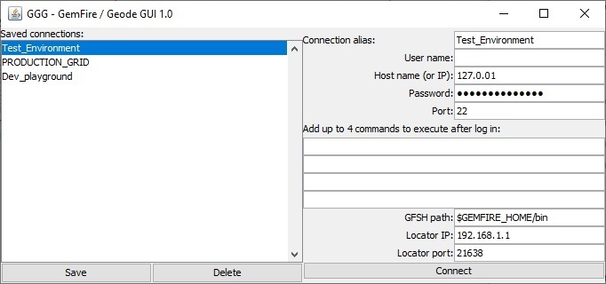
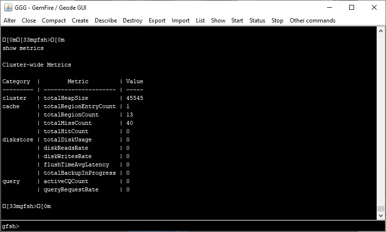
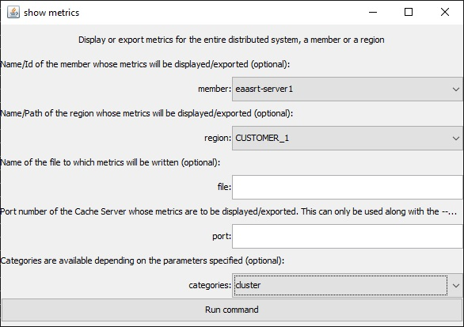
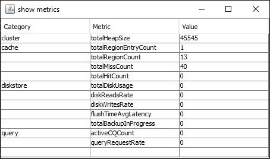

# GGGUI
### A graphic user interface for managing Gemfire or Geode grids on remote machines using GFSH.

GGGUI - Gemfire/Geode GUI aims to be a tool for easing the maintenance, operation, and development of In Memory Data Grids based on GemFire or Apache Geode.
It connects to a remote system using JSch, then runs any GFSH (GemFire Shell) command, using a friendlier interface than the command line.
It also displays command results on tables for easing the viewing and selecting of data.

### Screenshots

Initial window for managing and saving connections to different grids.

Main window with terminal for manual command entry and menus for accessing all available commands.

Sample window for selecting parameters and running a command.

Sample resulting window after running a command.

### Getting started

For using GGGUI you will need java version "16.0.2" or higher installed in your system.
Run "java -version" on your local prompt to check if you have java installed, and check which version you have.
Download the latest compiled jar file from /jar or get a release from the release section when available.
Fill the connections window information, keep in mind that GGGUI first does SSH into a remote machine, then optionally executes commands, and finally runs GFSH remotely on the target machine, which will connect to the Locator server of your grid using the IP and Port provided by you.

### Attributions

GGGUI is written on the Java programming language, it uses JSch as a Java Shell, and it is made for use with Gemfire or [Geode](https://github.com/apache/geode).

